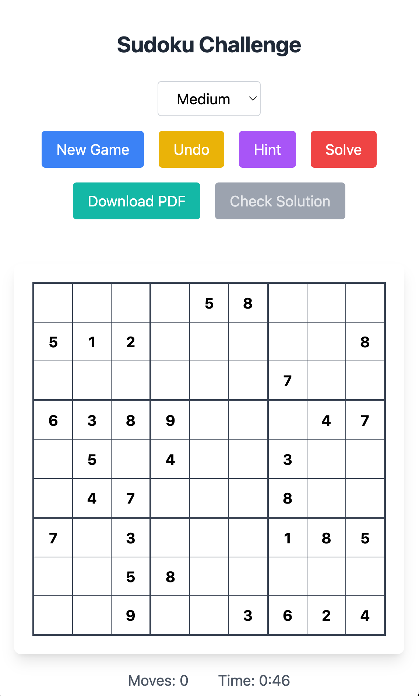

# Sudoku

A modern, performant Sudoku game built with Next.js 16, React 19, TypeScript, and Tailwind CSS 4. Features intelligent puzzle generation, real-time validation, and a beautiful responsive interface.



[](https://nextjs.org/)
[](https://react.dev/)
[](https://www.typescriptlang.org/)
[](https://tailwindcss.com/)
[](https://opensource.org/licenses/MIT)

## Live Demo

**[Play Sudoku →](https://sodokuapp.vercel.app/)**

## Features

### Gameplay

- **Intelligent Puzzle Generation** - Backtracking algorithm creates valid, solvable puzzles
- **Three Difficulty Levels** - Easy (51 clues), Medium (41 clues), Hard (31 clues)
- **Real-time Conflict Detection** - Instantly highlights invalid placements
- **Number Highlighting** - Click any number to highlight all matching cells
- **Pencil Marks (Notes)** - Toggle Notes mode to add candidate numbers to empty cells
- **Auto Notes** - One-click candidate fill that can stay in sync as you play
- **Auto-check (Optional)** - Highlight incorrect entries as you play

### Game Controls

- **New Game** - Generate a fresh puzzle at current difficulty
- **Undo** - Step-by-step move reversal with full history
- **Hint** - Reveals a random empty cell's correct value
- **Solve** - Auto-complete the puzzle (marks as assisted)
- **Check** - Validate solution and highlight incorrect cells
- **PDF Export** - Download puzzle for offline play
- **Auto Notes** - Auto-fill candidate notes for all empty cells
- **Number Pad** - Tap 1-9 and Erase for mobile-friendly play

### User Experience

- **Responsive Design** - Optimized for desktop, tablet, and mobile
- **Keyboard Support** - Type 1-9 and use arrow keys to move between cells
- **Touch Optimized** - Mobile-friendly input handling
- **Progress Tracking** - Move counter and elapsed time
- **Win Detection** - Celebration modal on puzzle completion
- **Accessibility** - ARIA labels and semantic markup

## Tech Stack

### Core

| Package                                       | Version | Purpose                      |
| --------------------------------------------- | ------- | ---------------------------- |
| [Next.js](https://nextjs.org/)                | 16.1.6  | React framework (App Router) |
| [React](https://react.dev/)                   | 19.2.4  | UI library                   |
| [React DOM](https://react.dev/)               | 19.2.4  | React renderer               |
| [TypeScript](https://www.typescriptlang.org/) | 5.9.3   | Type safety                  |
| [Tailwind CSS](https://tailwindcss.com/)      | 4.1.18  | Utility-first styling        |

### State & Utilities

| Package                                                     | Version | Purpose                      |
| ----------------------------------------------------------- | ------- | ---------------------------- |
| [Zustand](https://zustand-demo.pmnd.rs/)                    | 5.0.11  | Lightweight state management |
| [Lucide React](https://lucide.dev/)                         | 0.563.0 | Icons                        |
| [jsPDF](https://github.com/parallax/jsPDF)                  | 4.0.0   | PDF generation               |
| [clsx](https://github.com/lukeed/clsx)                      | 2.1.1   | Conditional classnames       |
| [tailwind-merge](https://github.com/dcastil/tailwind-merge) | 3.4.0   | Merge Tailwind classes       |

### Development

| Package                                                                       | Version | Purpose                    |
| ----------------------------------------------------------------------------- | ------- | -------------------------- |
| [ESLint](https://eslint.org/)                                                 | 9.39.2  | Code linting               |
| [eslint-config-next](https://nextjs.org/docs/app/api-reference/config/eslint) | 16.1.6  | Next.js ESLint defaults    |
| [PostCSS](https://postcss.org/)                                               | 8.5.6   | CSS processing             |
| [@tailwindcss/postcss](https://tailwindcss.com/)                              | 4.1.18  | Tailwind v4 PostCSS plugin |
| [@types/node](https://www.npmjs.com/package/@types/node)                      | 25.0.0  | Node.js types              |
| [@types/react](https://www.npmjs.com/package/@types/react)                    | 19.0.10 | React types                |
| [@types/react-dom](https://www.npmjs.com/package/@types/react-dom)            | 19.0.4  | React DOM types            |

## Getting Started

### Prerequisites

- Node.js **20.9.0** or higher
- npm, yarn, pnpm, or bun

### Installation

```bash
# Clone the repository
git clone https://github.com/brown2020/sodoku.git
cd sodoku

# Install dependencies
npm install

# Start development server
npm run dev
```

Open [http://localhost:3000](http://localhost:3000) to play.

### Available Scripts

```bash
npm run dev      # Start development server (Next.js / Turbopack)
npm run build    # Create production build
npm run start    # Start production server
npm run lint     # Run ESLint
```

## Project Structure

```
sodoku/
├── src/
│   ├── app/
│   │   ├── globals.css        # Global styles & animations
│   │   ├── layout.tsx         # Root layout with metadata
│   │   └── page.tsx           # Main page (renders SudokuMain)
│   │
│   ├── constants/
│   │   └── index.ts           # Grid + gameplay constants
│   │
│   ├── components/
│   │   ├── ControlPanel.tsx   # Game control buttons
│   │   ├── NumberPad.tsx      # On-screen 1-9 keypad + erase
│   │   ├── SudokuCell.tsx     # Individual cell (input/display)
│   │   ├── SudokuGrid.tsx     # 9x9 grid with 3x3 boxes
│   │   └── SudokuMain.tsx     # Main game container & sub-components
│   │
│   ├── lib/
│   │   └── utils.ts           # cn() helper, formatTime()
│   │
│   ├── store/
│   │   └── useGameStore.ts    # Zustand store (game state & actions)
│   │
│   ├── types/
│   │   └── index.ts           # TypeScript types & constants
│   │
│   └── utils/
│       ├── gameEngine.ts      # Public game-engine API (re-exports below)
│       ├── gridConversion.ts  # toIndex/fromIndex + grid<->flat conversions
│       ├── validation.ts      # conflicts, correctness checks, fill checks
│       ├── candidates.ts      # candidate (auto-notes) computation
│       ├── generatePdf.ts     # PDF export functionality
│       └── sudokuUtils.ts     # Puzzle generation
│
├── public/
│   └── screenshot.png         # Game screenshot
│
├── .eslintrc.json             # ESLint config
├── next.config.mjs            # Next.js configuration
├── postcss.config.mjs         # PostCSS configuration
├── tsconfig.json              # TypeScript configuration
└── package.json               # Dependencies & scripts
```

## Architecture

### State Management

The game uses **Zustand** for global state management with a single store:

```typescript
// Key state slices
interface GameState {
  puzzle: Uint8Array; // Flat 81-length current puzzle (row-major)
  initialPuzzle: Uint8Array; // Flat original puzzle (immutable cells)
  solution: Uint8Array; // Flat solution
  notes: Uint16Array; // Flat pencil marks bitmask per cell
  areNotesAuto: boolean; // Auto-notes enabled (recompute notes when puzzle changes)
  ruleConflicts: Uint8Array; // Live duplicate conflicts
  checkHighlights: Uint8Array; // Incorrect-cell highlights after "Check"
  incorrectHighlights: Uint8Array; // Incorrect-cell highlights when auto-check is enabled
  history: Move[]; // Undo history (delta-based)
  difficulty: Difficulty; // easy | medium | hard
  status: GameStatus; // isComplete, isSolved, hasWon
  stats: GameStats; // moveCount, timeElapsed, startTime
  selectedNumber: number | null; // For number highlighting
  selectedCellIdx: number | null; // For peer highlighting / keypad input
  isNotesMode: boolean;
  isAutoCheckEnabled: boolean;
}
```

### Performance Optimizations

| Optimization                 | Implementation                                            |
| ---------------------------- | --------------------------------------------------------- |
| **Component Memoization**    | All components wrapped with `React.memo()`                |
| **Granular Selectors**       | `useShallow` for grouped state subscriptions              |
| **Delta-based History**      | Stores only `{position, previousValue}` per move          |
| **Static Config Extraction** | Button configs, difficulty levels outside components      |
| **Stable References**        | `useCallback` for handlers, `useMemo` for computed values |
| **Timeout Cleanup**          | Conflict timeout properly cleared on new game             |

### Puzzle Generation

1. **Full Grid Generation** - Backtracking algorithm fills a valid 9x9 grid
2. **Number Removal** - Randomly removes cells based on difficulty
3. **Fallback Grid** - Pre-computed valid grid if generation fails
4. **Minimum Clues** - Ensures at least 20 numbers remain visible

### Conflict Detection

Real-time validation checks:

- Row conflicts (duplicate in same row)
- Column conflicts (duplicate in same column)
- Box conflicts (duplicate in same 3x3 box)

## How to Play

### Controls

| Action           | Input                   |
| ---------------- | ----------------------- |
| Select cell      | Click/tap on cell       |
| Enter number     | Type 1-9                |
| Clear cell       | Backspace, Delete, or 0 |
| Highlight number | Click any filled cell   |

### Tips

- Use the **number highlighting** to spot where a number can go
- The **Check** button only works when all cells are filled
- Use **Auto notes** to quickly populate candidate notes (and keep them updated as you enter numbers)
- **Hints** count as moves but don't disqualify a win
- Using **Solve** marks the game as assisted (no win modal)

## Contributing

Contributions are welcome! Please follow these steps:

1. **Fork** the repository
2. **Create** a feature branch: `git checkout -b feature/amazing-feature`
3. **Commit** changes: `git commit -m 'Add amazing feature'`
4. **Push** to branch: `git push origin feature/amazing-feature`
5. **Open** a Pull Request

### Development Guidelines

- Follow existing code style (Prettier formatting)
- Add TypeScript types for new code
- Use Zustand selectors for state access
- Wrap new components with `memo()` when appropriate
- Test on mobile and desktop before submitting

## Roadmap

- [x] Pencil marks (candidate numbers)
- [x] Auto notes (auto-fill + keep candidates updated)
- [x] Keyboard arrow navigation
- [ ] Local storage persistence
- [ ] Dark mode support
- [ ] Statistics tracking
- [ ] Daily challenges

## License

This project is licensed under the [MIT License](LICENSE).

## Contact

- **GitHub**: [@brown2020](https://github.com/brown2020)
- **Email**: [info@ignitechannel.com](mailto:info@ignitechannel.com)
- **Website**: [ignite.me](https://ignite.me)

---

<p align="center">
  Built with ❤️ using Next.js 16, React 19, and Tailwind CSS 4
</p>
